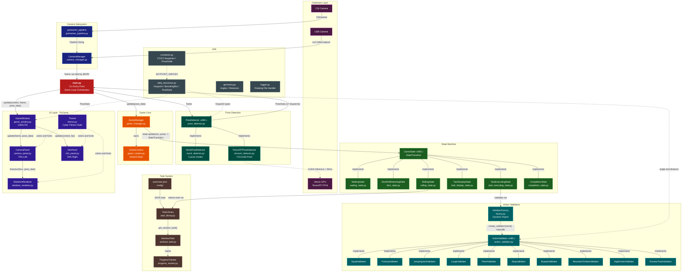

# System Architecture

> 健身骰子遊戲（弱雞轉換器）完整架構圖

```mermaid
graph TD

%% ── Hardware Layer ──────────────────────────────────────────
    subgraph Hardware["Hardware Layer"]
        CSI[CSI Camera]
        USB[USB Camera]
        GPU[Jetson GPU<br/>TensorRT FP16]
    end

%% ── Camera Subsystem ───────────────────────────────────────
    subgraph CameraSub["Camera Subsystem"]
        CM[CameraManager<br/><i>camera_manager.py</i>]
        GST[gstreamer_pipeline<br/><i>gstreamer_pipeline.py</i>]
    end

%% ── Pose Detection ────────────────────────────────────────
    subgraph Detection["Pose Detection"]
        PD["PoseDetector «ABC»<br/><i>pose_detector.py</i>"]
        Mock[MockPoseDetector<br/><i>mock_detector.py</i><br/>5 pose modes]
        TRT[TensorRTPoseDetector<br/><i>tensorrt_detector.py</i><br/>YOLOv8n-Pose]
    end

%% ── Entry Point ────────────────────────────────────────────
    Main["<b>main.py</b><br/>CLI Entry Point<br/>Game Loop Orchestrator"]

%% ── Game Core ──────────────────────────────────────────────
    subgraph GameCore["Game Core"]
        GM[GameManager<br/><i>game_manager.py</i>]
        GC[GameContext<br/><i>game_context.py</i><br/>Shared State]
    end

%% ── State Machine ──────────────────────────────────────────
    subgraph StateMachine["State Machine"]
        GS["GameState «ABC»<br/>StateTransition"]
        S1[WaitingState<br/><i>waiting_state.py</i>]
        S2[DiceRollDetectingState<br/><i>dice_state.py</i>]
        S3[RollingState<br/><i>rolling_state.py</i>]
        S4[TaskDisplayState<br/><i>task_display_state.py</i>]
        S5[TaskExecutingState<br/><i>task_executing_state.py</i>]
        S6[CompletionState<br/><i>completion_state.py</i>]
    end

%% ── Task System ────────────────────────────────────────────
    subgraph TaskSystem["Task System"]
        TL[TaskLibrary<br/><i>task_library.py</i>]
        WT[WorkoutTask<br/><i>workout_task.py</i>]
        PT[ProgressTracker<br/><i>progress_tracker.py</i>]
        EJ[exercises.json<br/><i>config/</i>]
    end

%% ── Validators ─────────────────────────────────────────────
    subgraph Validators["Action Validators"]
        AV["ActionValidator «ABC»<br/><i>action_validator.py</i>"]
        VF[ValidatorFactory<br/><i>factory.py</i><br/>Dynamic Import]
        V1[SquatValidator]
        V2[PushupValidator]
        V3[JumpingJackValidator]
        V4[LungeValidator]
        V5[PlankValidator]
        V6[SitupValidator]
        V7[BurpeeValidator]
        V8[MountainClimberValidator]
        V9[HighKneesValidator]
        V10[RussianTwistValidator]
    end

%% ── UI Layer ───────────────────────────────────────────────
    subgraph UILayer["UI Layer - PyGame"]
        GW[GameWindow<br/><i>game_window.py</i><br/>1280x720]
        CP[CameraPanel<br/><i>camera_panel.py</i><br/>70% Left]
        IP[InfoPanel<br/><i>info_panel.py</i><br/>30% Right]
        SR[SkeletonRenderer<br/><i>skeleton_renderer.py</i>]
        TH[Theme<br/><i>theme.py</i><br/>Cyber Fitness Style]
    end

%% ── Utils Layer ────────────────────────────────────────────
    subgraph Utils["Utils"]
        DS[data_structures.py<br/>Keypoint / BoundingBox / PoseData]
        CO[constants.py<br/>COCO Keypoints / Thresholds]
        GEO[geometry.py<br/>Angles / Distances]
        LOG[logger.py<br/>Rotating File Handler]
    end

%% ── Hardware to Camera ─────────────────────────────────────
    CSI -->|GStreamer| GST
    USB -->|cv2.VideoCapture| CM
    GST -->|Pipeline String| CM

%% ── Main Loop Data Flow ───────────────────────────────────
    CM -->|"frame: np.ndarray (BGR)"| Main
    Main -->|frame| PD
    PD -->|"PoseData (17 keypoints)"| Main

%% ── Detection Hierarchy ───────────────────────────────────
    PD ---|implements| Mock
    PD ---|implements| TRT
    TRT -.->|"CUDA Inference < 50ms"| GPU

%% ── Main to Game Core ─────────────────────────────────────
    Main -->|"update(pose_data)"| GM
    GM -->|owns| GC

%% ── GameManager to State Machine ──────────────────────────
    GM -->|"state.update(ctx, pose) -> StateTransition"| GS
    GS ---|implements| S1
    GS ---|implements| S2
    GS ---|implements| S3
    GS ---|implements| S4
    GS ---|implements| S5
    GS ---|implements| S6

%% ── Main to UI ────────────────────────────────────────────
    Main -->|"update(context, frame, pose_data)"| GW
    GW -->|"update(frame, pose_data)"| CP
    GW -->|"update(context, fps)"| IP
    CP -->|"draw(surface, pose_data)"| SR
    TH -.->|colors and fonts| CP
    TH -.->|colors and fonts| IP
    TH -.->|colors and fonts| SR

%% ── Task System Flow ──────────────────────────────────────
    EJ -->|JSON load| TL
    TL -->|"get_random_task()"| WT
    WT -->|tracks| PT
    S3 -->|selects task via| TL
    S5 -->|validates via| VF

%% ── Validator Hierarchy ───────────────────────────────────
    VF -->|"create_validator(name) importlib"| AV
    AV ---|implements| V1
    AV ---|implements| V2
    AV ---|implements| V3
    AV ---|implements| V4
    AV ---|implements| V5
    AV ---|implements| V6
    AV ---|implements| V7
    AV ---|implements| V8
    AV ---|implements| V9
    AV ---|implements| V10

%% ── Utils Dependencies ────────────────────────────────────
    DS -.->|Keypoint types| PD
    DS -.->|PoseData| GW
    CO -.->|KEYPOINT_INDICES| DS
    GEO -.->|angle and distance| AV

%% ── Styling ────────────────────────────────────────────────
    classDef hw fill:#4a1942,stroke:#e040fb,color:#fff
    classDef camera fill:#1a237e,stroke:#42a5f5,color:#fff
    classDef detect fill:#004d40,stroke:#26a69a,color:#fff
    classDef entry fill:#b71c1c,stroke:#ef5350,color:#fff
    classDef core fill:#e65100,stroke:#ff9800,color:#fff
    classDef state fill:#1b5e20,stroke:#66bb6a,color:#fff
    classDef task fill:#4e342e,stroke:#8d6e63,color:#fff
    classDef valid fill:#006064,stroke:#00acc1,color:#fff
    classDef ui fill:#311b92,stroke:#7c4dff,color:#fff
    classDef util fill:#37474f,stroke:#78909c,color:#fff

    class CSI,USB,GPU hw
    class CM,GST camera
    class PD,Mock,TRT detect
    class Main entry
    class GM,GC core
    class GS,S1,S2,S3,S4,S5,S6 state
    class TL,WT,PT,EJ task
    class AV,VF,V1,V2,V3,V4,V5,V6,V7,V8,V9,V10 valid
    class GW,CP,IP,SR,TH ui
    class DS,CO,GEO,LOG util
```
