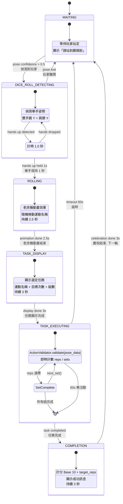

# State Machine

> 遊戲狀態轉換圖

```mermaid
stateDiagram-v2
    [*] --> WAITING

    WAITING --> DICE_ROLL_DETECTING : pose confidence > 0.5<br/>偵測到玩家

    DICE_ROLL_DETECTING --> WAITING : pose lost<br/>玩家離開
    DICE_ROLL_DETECTING --> ROLLING : hands up held 1s<br/>舉手保持 1 秒

    ROLLING --> TASK_DISPLAY : animation done 2.5s<br/>老虎機動畫結束

    TASK_DISPLAY --> TASK_EXECUTING : display done 3s<br/>任務顯示完成

    TASK_EXECUTING --> COMPLETION : task completed<br/>任務完成
    TASK_EXECUTING --> WAITING : timeout 60s<br/>逾時

    COMPLETION --> WAITING : celebration done 3s<br/>慶祝結束, 下一輪

    state WAITING {
        [*] --> DetectingPlayer
        DetectingPlayer : 等待玩家站定
        DetectingPlayer : 顯示「請站到鏡頭前」
    }

    state DICE_ROLL_DETECTING {
        [*] --> WatchingPose
        WatchingPose : 偵測舉手姿勢
        WatchingPose : 雙手腕 Y < 肩膀 Y
        WatchingPose --> HoldTimer : hands up detected
        HoldTimer : 計時 1.0 秒
        HoldTimer --> WatchingPose : hands dropped
    }

    state ROLLING {
        [*] --> SlotMachine
        SlotMachine : 老虎機動畫效果
        SlotMachine : 隨機捲動運動名稱
        SlotMachine : 持續 2.5 秒
    }

    state TASK_DISPLAY {
        [*] --> ShowTask
        ShowTask : 顯示選定任務
        ShowTask : 運動名稱 + 目標次數 + 組數
        ShowTask : 持續 3 秒
    }

    state TASK_EXECUTING {
        [*] --> Validating
        Validating : ActionValidator.validate(pose_data)
        Validating : 即時計數 reps / sets
        Validating --> SetComplete : reps 達標
        SetComplete --> Validating : next_set()
        SetComplete --> [*] : 所有組完成
        Validating --> [*] : 60s 無活動
    }

    state COMPLETION {
        [*] --> Celebrating
        Celebrating : 計分 Base 10 + target_reps
        Celebrating : 顯示成功訊息
        Celebrating : 持續 3 秒
    }
```
