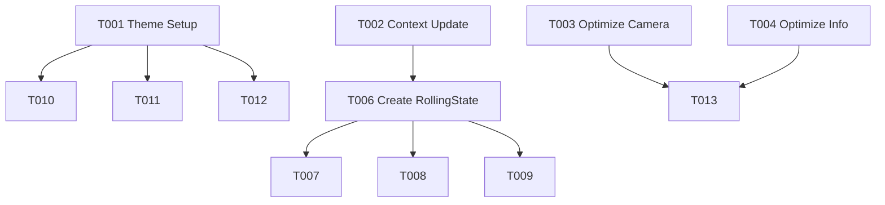

# Tasks: Enhance Game Experience

**Feature**: Enhance Game Experience
**Branch**: `003-enhance-game-experience`
**Status**: In Progress

## Phase 1: Setup
*Project initialization and shared resources*

- [x] T001 Create `src/ui/theme.py` with `Theme` class and color/font definitions

## Phase 2: Foundational
*Blocking prerequisites for multiple user stories*

- [x] T002 Update `src/models/game_context.py` to add `rolling_current_item` and `rolling_end_time` fields

## Phase 3: User Story 1 - Smooth Gameplay Performance (P1)
*Goal: Achieve >20 FPS on Jetson Orin Nano*

- [x] T003 [US1] Refactor `src/ui/camera_panel.py` to use OpenCV for image resizing and color conversion
- [x] T004 [US1] Refactor `src/ui/info_panel.py` to implement text surface caching (avoid re-rendering unchanged text)
- [x] T005 [US1] Optimize `src/ui/game_window.py` to implement dirty rects and minimize PyGame overhead

## Phase 4: User Story 2 - Lottery/Gacha Animation (P2)
*Goal: Add excitement to the dice roll*

- [x] T006 [US2] Create `src/states/rolling_state.py` implementing the `RollingState` class
- [x] T007 [US2] Update `src/states/dice_state.py` to transition to `ROLLING` instead of `TASK_DISPLAY`
- [x] T008 [US2] Update `src/main.py` to register `RollingState` with `GameManager`
- [x] T009 [US2] Update `src/ui/info_panel.py` to render the "Rolling" animation state

## Phase 5: User Story 3 - Modern UI Polish (P3)
*Goal: Professional and cohesive visual style*

- [x] T010 [US3] Update `src/ui/info_panel.py` to use `Theme` colors, fonts, and rounded corners
- [x] T011 [US3] Update `src/ui/skeleton_renderer.py` to use `Theme` colors and optimize drawing calls (batching)
- [x] T012 [US3] Update `src/ui/camera_panel.py` to use `Theme` fonts for overlays
- [x] T016 [US3] Implement Loading Screen in `src/ui/game_window.py` for model initialization (FR-007)

## Phase 6: Polish & Cross-Cutting
*Final validation and cleanup*

- [ ] T013 Validate FPS performance on Jetson Orin Nano
- [x] T014 Validate Chinese text rendering with new fonts
- [ ] T015 Verify "Rolling" animation smoothness and transition

## Dependencies

## Implementation Strategy

1.  **Setup**: Create the Theme and Context updates first as they are lightweight dependencies.
2.  **Performance (US1)**: Tackle the FPS issues immediately (T003, T004) to ensure the subsequent UI work doesn't degrade performance again.
3.  **Animation (US2)**: Implement the logic for the new state.
4.  **Polish (US3)**: Apply the visual skinning last.

## Parallel Execution Examples

- **Developer A** can work on **US1 (Performance)** (T003, T004) while **Developer B** works on **US2 (Logic)** (T006, T007).
- **Developer C** can start **US3 (Theme)** (T001, T010) once T001 is defined.
